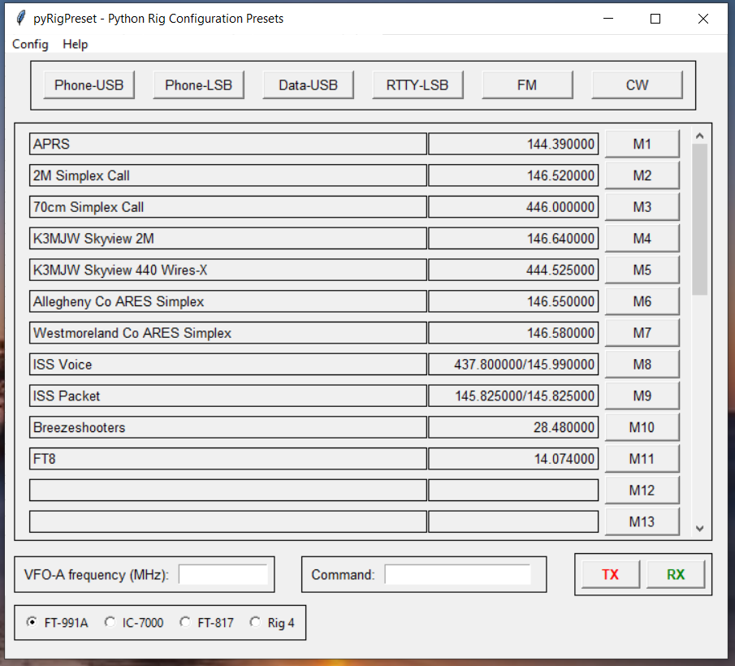

# AB3GY pyRigPreset
Amateur radio Python application to provide transceiver configuration presets.

Provides a convenient way to configure a transceiver for various frequencies and modes of operation without having to dig through multiple layers of menus.

Lots more documentation is needed, please stay tuned.

The main application file is `pyRigPreset.py`

## Dependencies
Written for Python 3.x.  Uses tkinter for the GUI.

Requires the `serial` package from PyPI. May need to be installed using pip.

Requires the `PyRigCat` package for CAT control of a transceiver.  Copy this package to a local directory and modify the `_env_init.py` file to point to this package.

Repository: https://github.com/tkerr/ab3gy-PyRigCat

This package has been tested on Windows 10 PCs. Other operating systems have not been tested.

## Author
Tom Kerr AB3GY
ab3gy@arrl.net

## License
Released under the 3-clause BSD license.
See license.txt for details.

## Screenshots

### Main window:

